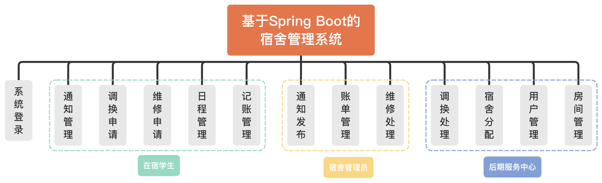
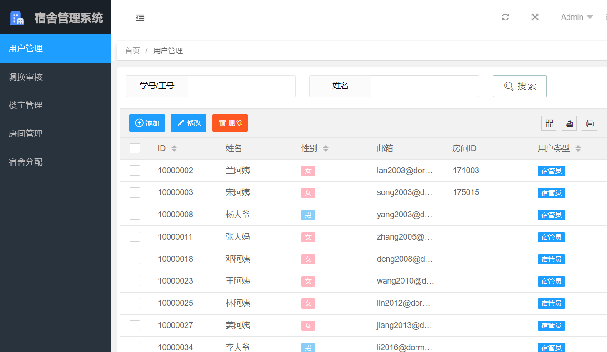
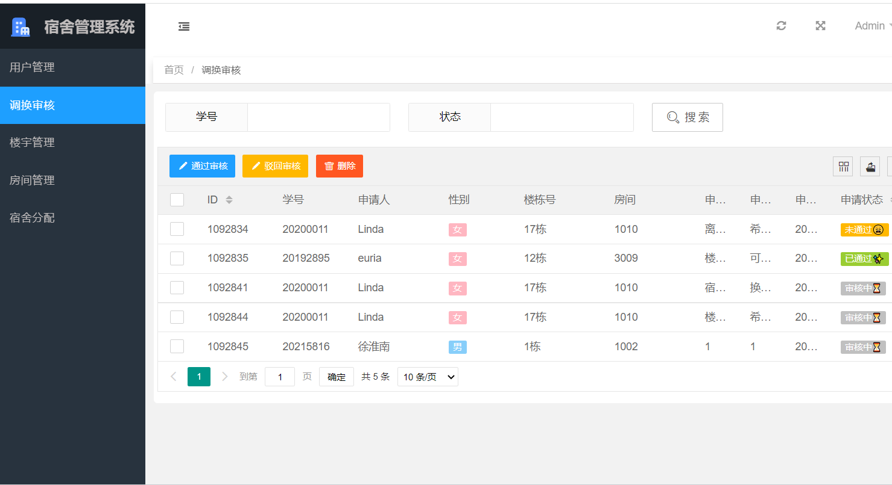
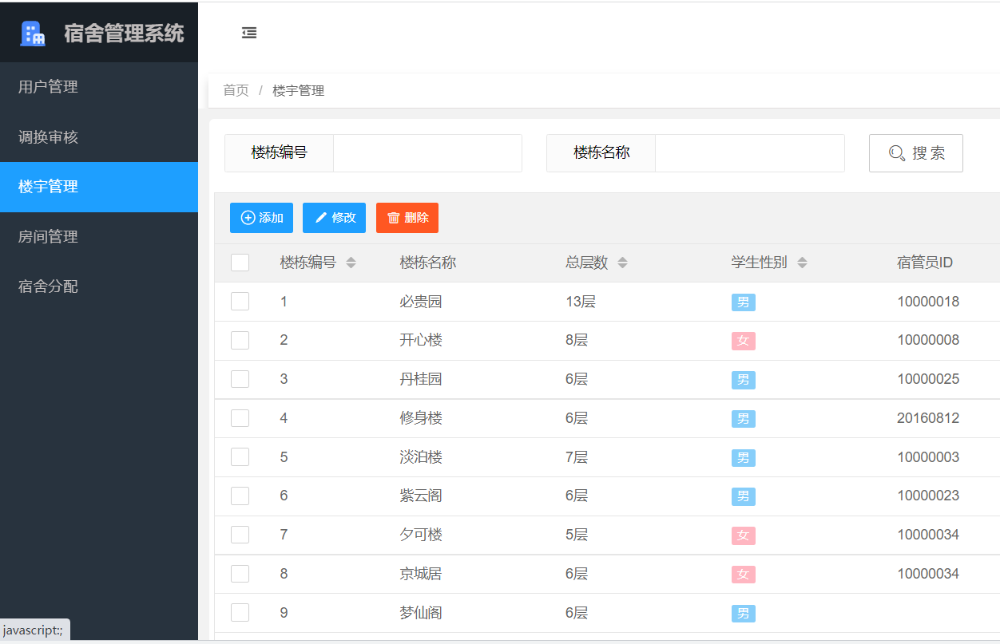
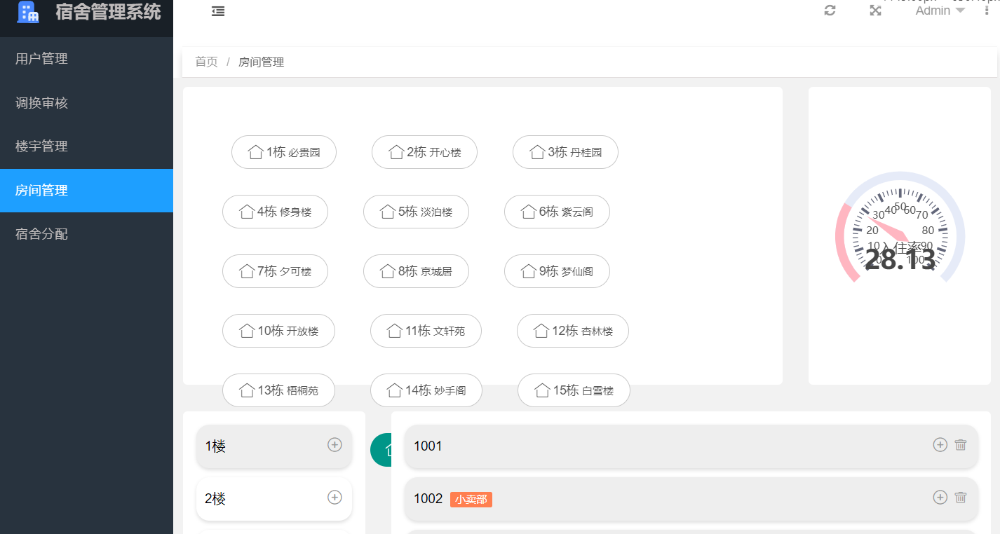
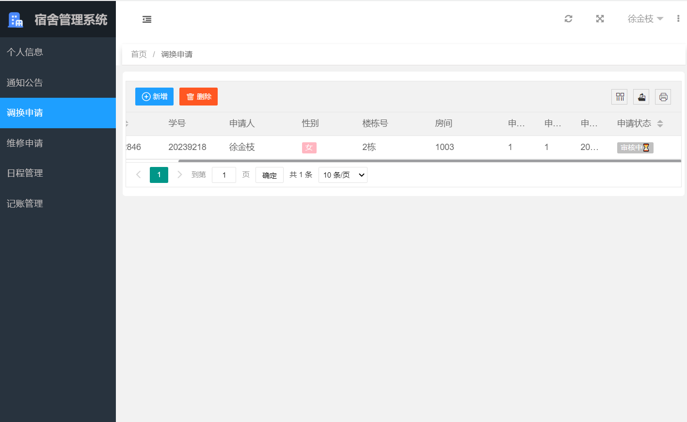
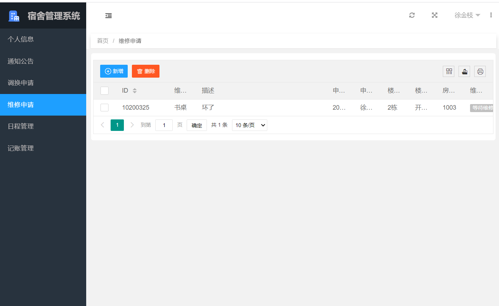
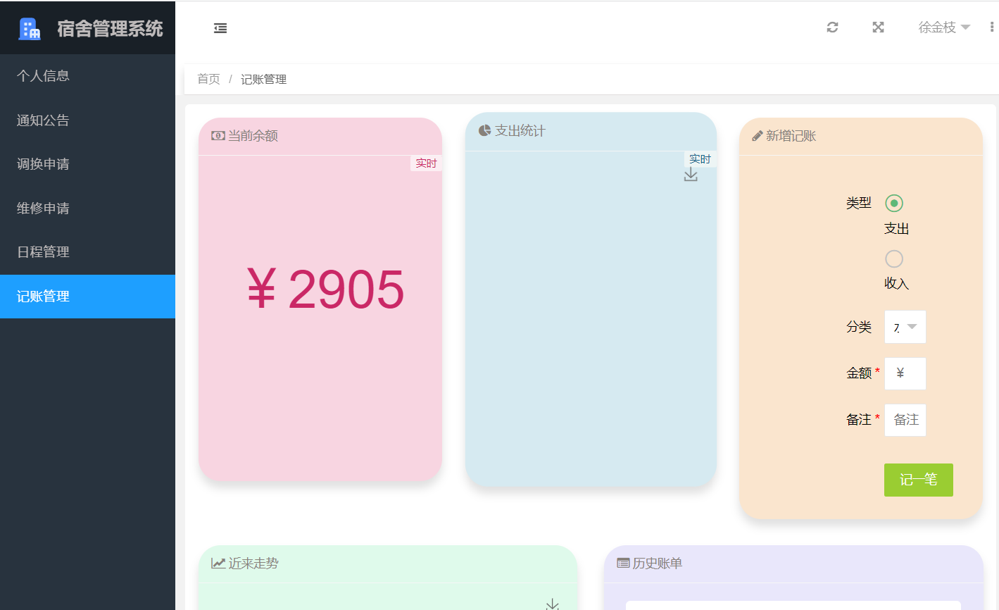
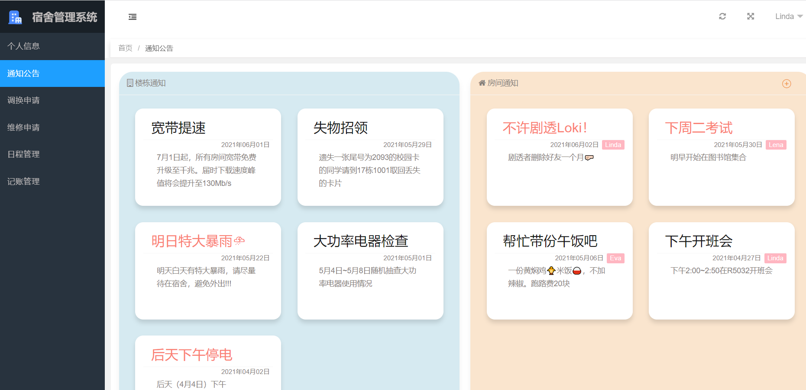
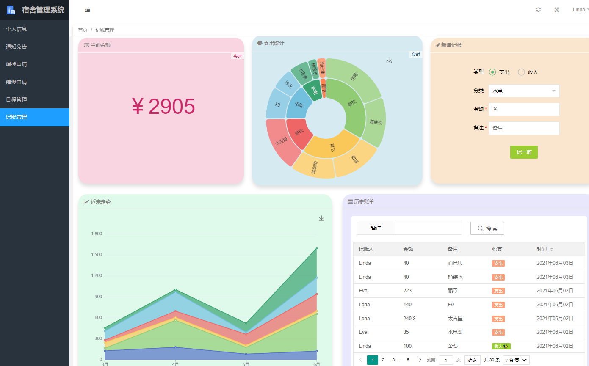

### 作者QQ：1556708905(支持修改、 部署调试、 支持代做毕设)

#### 支持代做任何毕设论、接网站建设、小程序、H5、APP、各种系统等

**毕业设计所有选题地址 [https://github.com/zhengjianzhong0107/allProject](https://github.com/zhengjianzhong0107/allProject)**

**博客地址：[https://blog.csdn.net/2303_76227485/article/details/128658542](https://blog.csdn.net/2303_76227485/article/details/128658542)**

**视频演示：[https://www.bilibili.com/video/BV1ZW4y1S7dZ/](https://www.bilibili.com/video/BV1ZW4y1S7dZ/)**

 
## 基于SpringBoot宿舍管理系统(源代码+数据库+7700字文档)

## 一、系统介绍

- 系统中的用户分为三类，分别为学生、宿管、后勤。这三类用户拥有不同的操作权限。
  包括用户管理、房间管理，楼宇管理，维修申请，特色功能有人性化的宿舍分配，可视化的账单管理、房间管理、记账管理，Excel文件上传后数据导入数据库等等。
- 系统的功能模块图如下图所示。
  

## 二、所用技术

后端技术栈：

- Spring Boot + SpringMVC + MyBatis 

前端技术栈：

- Echarts
- Axios
- POI
- Layui

## 三、环境介绍

基础环境 :IDEA/eclipse, JDK 1.8, Mysql5.7及以上,Maven

所有项目以及源代码本人均调试运行无问题 可支持远程调试运行

## 四、页面截图

## 五、浏览地址

* http://localhost:63342/dormitory/static/page/index.html
  从编译器里面打开

  管理员(后勤中心)： 用户名：Admin  密码：123A
  学生：            用户名：Linda  密码：123L
  宿管员：          用户名：兰阿姨  密码：123M

## 六、安装教程

1. 在你的Mysql中，创建一个数据库名称为 EducationalManagementSystem 的数据库，并导入我提供的database目录下 .sql 文件。
2. 进入src/main/resources修改application.properties配置文件,把数据库登录名和密码，改为你本地的
3. 使用 IntelliJ IDEA 导入项目，选择Maven项目选项，一路点击next就行。
4. 在 IntelliJ IDEA 中，运行SpringBoot启动类。

文件夹介绍：

  * `database`中存放的是sql文件
  * `dormitory`中存放的是后端代码
  * `dormitoryfront`中存放的是前端代码
  * `excel`中存放的是系统运行时文件上传部分可能用到的Excel文件
    	
 
